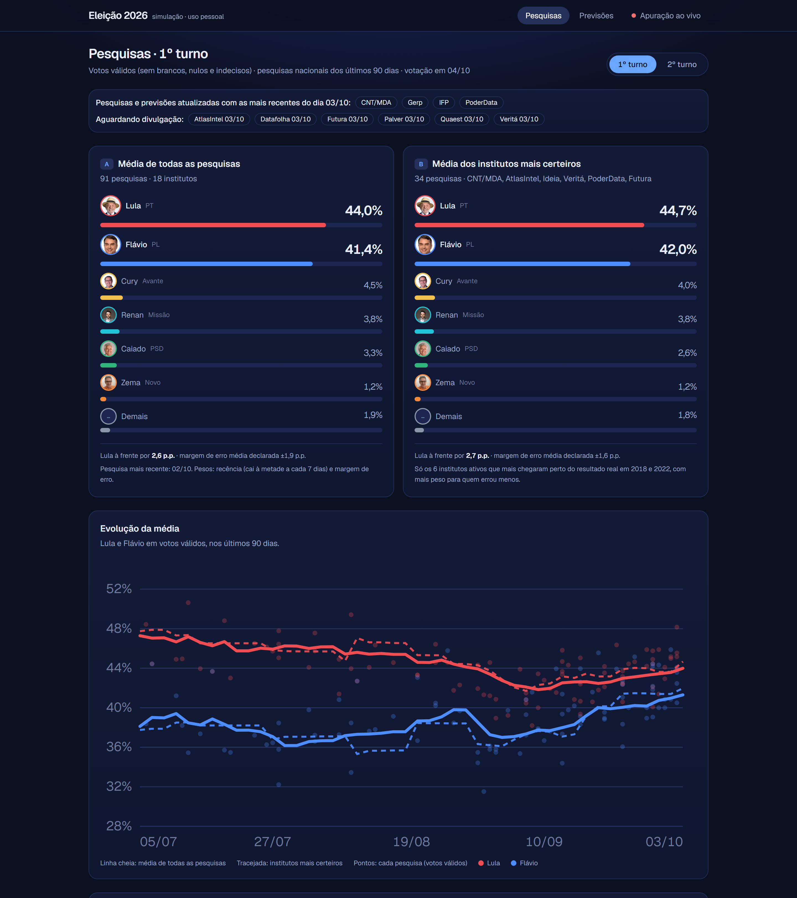
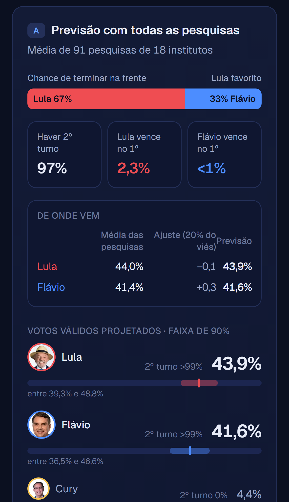
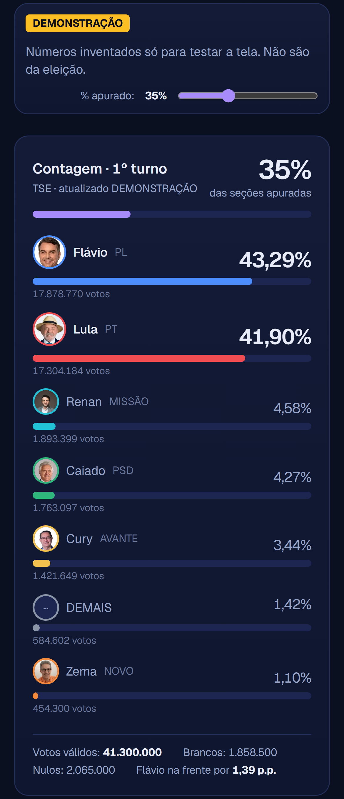
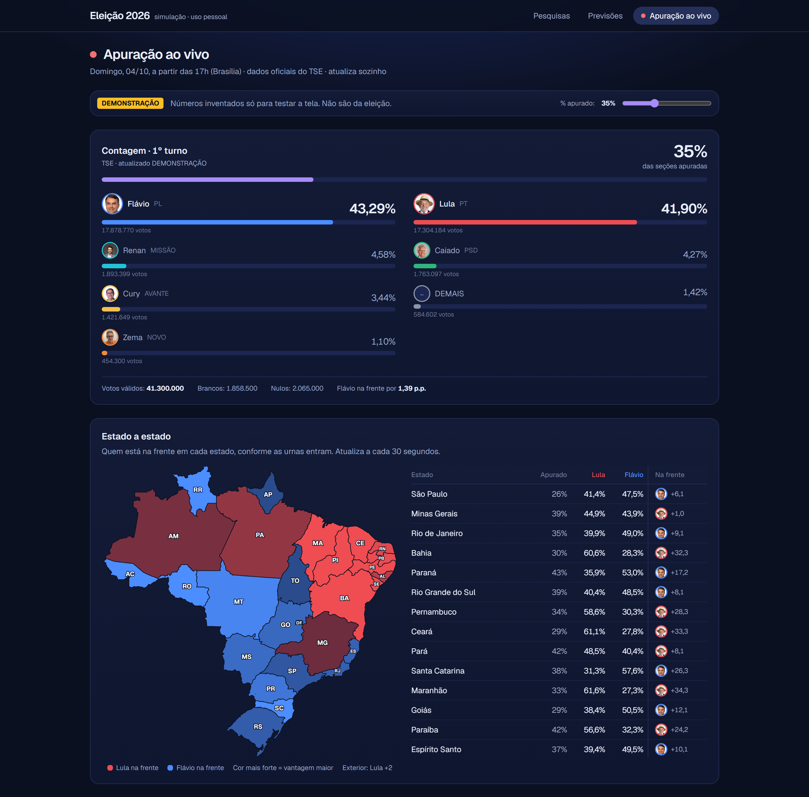

# Eleição 2026 · Simulação

Painel pessoal para acompanhar a eleição presidencial de 2026: pesquisas em votos válidos, previsões e apuração ao vivo do 1º turno (04/10/2026), com comparação entre a contagem real e o que as pesquisas/previsões apontavam.

**Site no ar:** https://painel-eleicoes-2026.vercel.app



<table>
  <tr>
    <td width="50%"></td>
    <td width="50%"></td>
  </tr>
</table>



> Os prints da apuração são do modo demonstração (`?env=demo`), com números inventados só para testar a tela. Não são resultados da eleição.

## Stack

- **Site:** Next.js 16 (App Router), TypeScript e Tailwind CSS v4, hospedado na Vercel. Sem banco de dados: a Wikipédia (pesquisas) e o TSE (apuração) são lidos no servidor, com cache.
- **Cálculos:** média ponderada das pesquisas, nota de acerto dos institutos em 2018 e 2022 e previsão com 20 mil simulações, tudo em TypeScript (`src/lib/model.ts`).
- **Python (scripts de apoio):** `scripts/build_data.py` monta a base histórica a partir da Wikipédia e `scripts/gen_brazil_map.py` gera o mapa dos estados a partir da malha do IBGE. Rodam na máquina de quem desenvolve, não fazem parte do site em produção.

Projeto pessoal, sem vínculo com nenhum instituto de pesquisa, partido ou campanha.

## Telas

Três telas (Pesquisas e Previsões têm o botão **1º turno / 2º turno**, que usa `?turno=2`; a apuração é só do 1º turno):

| Rota | O que mostra |
|---|---|
| `/` | Média A (todas as pesquisas dos últimos 90 dias) e média B (só os institutos que mais acertaram em 2018 e 2022), evolução da média, ranking de acerto histórico, tabela de todas as pesquisas usadas. |
| `/previsoes` | Previsão A e B: votos válidos projetados com faixa de 90%, chance de liderar, de vencer no 1º turno, de haver 2º turno e de cada candidato ir ao 2º turno. Chave de correção do viés histórico (0%, 20% padrão, 50%). |
| `/apuracao` | Contagem do TSE (atualiza a cada 20 s), % de seções apuradas, mapa do Brasil e tabela estado a estado (quem lidera em cada UF), tabela contagem × pesquisas × previsões, ranking de quem está mais perto e gráfico do erro ao longo da apuração. |

Candidatos acompanhados: Lula, Flávio Bolsonaro, Ronaldo Caiado, Augusto Cury, Renan Santos e Romeu Zema (os demais entram em "Demais").

## Rodar localmente

```bash
npm install
npm run dev        # http://localhost:3000
```

Modos de teste da apuração (não dependem de a eleição ter começado):

- `/apuracao?env=demo`: simulação com números inventados e um controle de "% apurado".
- `/apuracao?env=simulado`: lê o ambiente de ensaio do TSE (candidatos fictícios), para testar a conexão.

## Como as pesquisas se atualizam

As pesquisas de 2026 são lidas da Wikipédia (que cita os registros do TSE) direto no servidor, no máximo a cada 5 minutos, e o cálculo é refeito em cada leitura. Só a seção "Primeiro turno > 2026" é baixada (código em `src/lib/polls.ts`). Se a Wikipédia falhar, o site usa a última leitura em memória e, na falta dela, a cópia salva em `data/polls2026.json`.

A Wikipédia pode demorar para registrar uma pesquisa nova. Nesse caso, adicione-a em `data/manual-polls.json` (e faça o deploy de novo). Ela tem prioridade sobre a mesma pesquisa vinda da Wikipédia. Valores em % do total de entrevistados, como divulgado:

```json
[
  {
    "institute": "AtlasIntel",
    "start": "2026-09-30",
    "end": "2026-10-02",
    "n": 5000,
    "moe": 1.0,
    "lula": 44.9, "flavio": 42.1, "caiado": 2.0, "cury": 2.1, "renan": 5.0, "zema": 1.0,
    "demais": 0.5, "outros": null, "indecisos": 2.0
  }
]
```

Use os nomes de instituto já existentes (`Datafolha`, `Quaest`, `AtlasIntel`, `Futura`, `Gerp`, `PoderData`, `CNT/MDA`, `Veritá`, `Nexus`, `Ideia`, `Real Time Big Data`, `Palver`, `Indexa`, `Vox Brasil`, `DataTrends`...) para o histórico de acerto ser aplicado.

As pesquisas de 2º turno (Lula × Flávio) seguem o mesmo esquema, em `data/manual-polls-r2.json`, com `lula` e `flavio` em % do total de entrevistados.

Para refazer as cópias salvas (`data/polls2026.json`, `data/polls2026_r2.json`) e os dados históricos de 1º e 2º turno de 2018/2022 (`data/history.json`) a partir da Wikipédia:

```bash
pip install beautifulsoup4 lxml
python scripts/build_data.py
```

O contorno dos estados vem da malha do IBGE e foi gerado por `python scripts/gen_brazil_map.py` (só precisa rodar de novo se quiser atualizar).

## Metodologia (resumo)

Detalhes na seção "Como calculamos" das telas.

- **Votos válidos**: cada pesquisa é normalizada pela soma dos candidatos (sem branco, nulo e indecisos).
- **Média**: peso por recência (meia-vida de 7 dias), margem de erro (0,5× a 2×) e amortecimento para institutos com muitas pesquisas (÷√n).
- **Institutos certeiros**: erro da última pesquisa antes do 1º turno de 2018 e 2022 contra o resultado do TSE, nos 4 mais votados (os 2 primeiros valem o dobro). 2022 pesa 2, 2018 pesa 1, com encolhimento para a média quando só há uma eleição. Média B = melhores 6 institutos ativos, ponderados por 1/nota².
- **2º turno**: mesma receita só com Lula × Flávio; o histórico usa o 2º turno de 2018 e 2022, e a chance de vencer é a parte de uma curva normal acima de 50%.
- **Previsão**: média + fração do viés histórico; incerteza = erro histórico + discordância entre institutos; 20 mil simulações com os dois líderes correlacionados negativamente (−0,25).

Limites: só duas eleições de referência, vários institutos novos sem histórico, e pesquisa é retrato do momento, não previsão.

## Apuração do TSE

Arquivo público lido no servidor (`src/lib/tse.ts`, rota `/api/apuracao`), porque o TSE não libera CORS para o navegador:

- Oficial: `https://resultados.tse.jus.br/oficial/ele2026/6257/dados/br/br-c0001-e006257-u.json`
- Simulado: `https://resultados-sim.tse.jus.br/simulado/simulado2026/ele2026/21270/dados/br/br-c0001-e021270-u.json`

Os estados vêm de `.../dados/<uf>/<uf>-c0001-e006257-u.json` (e `zz` para o exterior), lidos pela rota `/api/apuracao/uf` com cache de 15 s. Os candidatos são reconhecidos pelo número da urna (13, 22, 55, 70, 14, 30).

## Deploy (Vercel)

```bash
npm i -g vercel
vercel login
vercel --prod
```

`vercel.json` fixa a região de execução em `gru1` (São Paulo). Depois do deploy, abra `/api/apuracao` para confirmar que o servidor consegue ler o TSE.
